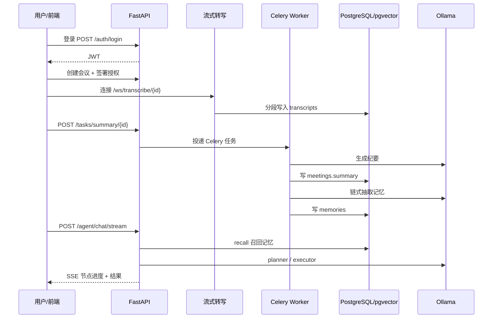

# AI 会议助理（Meeting Assistant）

一个面向**自托管 / 私有部署**的 AI 会议助理后端（含 Web 前端）。核心能力：实时流式语音转写、基于大模型的会议纪要与待办抽取、可召回的长期记忆层、具备人工闸门与审计的智能体（Agent），以及录音授权、分享、导出、软删除、审计日志等生产级合规特性。

> 本项目为自托管单用户/小团队场景设计，强调数据私有化、可审计与可本地化运行（ASR + LLM + Embedding 全部可离线）。

---

## 一、项目简介

Meeting Assistant 把「一段会议录音」变成「结构化、可检索、可追溯的知识」：

- 通过 WebSocket 实时转写会议音频，分段落库并向量化；
- 会议结束后由 LLM 生成纪要、抽取待办（action items）；
- 从会议内容中抽取**长期记忆**（决策 / 行动 / 偏好 / 事实 / 实体），支持相似去重与记忆演进链；
- 通过 **LangGraph Agent** 以自然语言驱动「召回记忆 → 规划 → 调用工具（含敏感操作人工确认）→ 汇报」的闭环；
- 全链路记录审计日志，支持录音授权（consent）、分享链接、导出与软删除。

---

## 二、核心特性

| 领域 | 能力 |
| --- | --- |
| 语音转写（ASR） | 本地 `faster-whisper`（CTranslate2）或云端 ASR（火山引擎）双后端；WebSocket 流式分段转写；VAD 端点检测 + 超时冲刷 |
| 大模型能力 | 会议纪要生成、待办抽取、语义搜索、长期记忆抽取（Ollama 本地模型） |
| 长期记忆层 | 双路召回（向量 `pgvector` + 关键词 `pg_trgm`）RRF 融合、相似去重、记忆演进链（superseded）、周期性归档 |
| 智能体 Agent | LangGraph 编排：RAG 召回 → 规划 → 人工闸门（敏感操作 interrupt 确认）→ 执行 → 汇报 → 审计；SSE 流式进度；会话滚动摘要 |
| 合规与安全 | JWT 鉴权、录音授权（consent）、审计日志（audit log）、软删除、分享链接、SlowAPI 限流 |
| 数据检索 | pgvector 向量检索 + pg_trgm 关键词检索 + RRF 混合排序 |
| 异步任务 | Celery 处理纪要生成、记忆抽取、归档；Redis 作为 broker/backend |
| 导出 | Markdown / PDF / DOCX 多格式导出 |
| Web 前端 | React 19 + Vite 7 + Tailwind v4 单页应用，含侧栏、设计系统、Agent 对话、记忆库、审计日志等页面 |
| 部署 | Docker Compose 全栈（db / redis / app / worker / beat）一键部署；代码 COPY 进镜像 |
| 可观测性 | 生产级 `/health`：并发探测 DB/Redis/Ollama，差异化降级（区分致命与可容忍依赖） |

---

## 三、技术栈

### 后端

| 类别 | 选型 |
| --- | --- |
| 语言 / 运行时 | Python 3.11 |
| Web 框架 | FastAPI + Uvicorn |
| ORM / 迁移 | SQLAlchemy 2.0（async）+ Alembic |
| 数据库 | PostgreSQL 16 + `pgvector`（向量）+ `pg_trgm`（关键词） |
| 缓存 / 消息队列 | Redis（Celery broker/backend + 限流存储） |
| 异步任务 | Celery |
| 大模型 / Embedding | Ollama（`qwen2.5:7b` + `bge-m3`），OpenAI 兼容接口 |
| Agent 编排 | LangGraph（`langgraph` + `langgraph-checkpoint-postgres`） |
| 本地 ASR | faster-whisper（CTranslate2，无需 PyTorch）+ silero-vad + librosa + soundfile |
| 云端 ASR | 火山引擎（volcengine SDK） |
| 鉴权 | JWT（`pyjwt`）+ `passlib[bcrypt]` |
| 限流 | SlowAPI + Redis 存储（多 worker 共享计数） |
| 导出 | python-docx / reportlab / markdown |
| 配置 | pydantic-settings（`.env`） |
| 包管理 | uv |

> ASR 基于 CTranslate2，**无需安装 PyTorch**；如需 GPU 加速仅需 NVIDIA 驱动，无需 CUDA Toolkit。

### 前端（`frontend/`）

| 类别 | 选型 |
| --- | --- |
| 框架 | React 19 + TypeScript 6 |
| 构建 | Vite 7 + `@vitejs/plugin-react` |
| 样式 | Tailwind CSS 4（CSS-first `@theme` + `@tailwindcss/vite`） |
| 动效 | Motion 13（`motion/react`） |
| 数据 | TanStack Query 5（服务端状态） |
| 客户端状态 | Zustand 5（auth / settings / sidebar / theme，persist） |
| 路由 | react-router 7（View Transitions + 共享元素过渡） |
| HTTP | axios（注入 JWT、401 自动登出） |
| 图标 / 图表 | lucide-react / recharts |
| 通知 | react-hot-toast |
| 质量 | ESLint 10 |

---

## 四、系统架构

```
┌─────────────────────────────────────────────────────────────┐
│                     FastAPI 应用 (app/main.py)                │
│  中间件：CORS · GZip · 请求日志 · SlowAPI 限流                  │
│  依赖注入(get_current_user) → JWT 鉴权 → owner_id 归属校验       │
└───────┬─────────────────────────────────────┬───────────────┘
        │ REST / WS / SSE                      │ Celery 投递
        ▼                                      ▼
┌──────────────────┐   ┌──────────────────┐   ┌──────────────────┐
│  Services 层      │   │  Agent (LangGraph)│   │  Workers (Celery) │
│ ASR/LLM/Meeting   │   │ recall→plan→gate  │   │ summary/memories  │
│ Memory/Export     │   │ →exec→report→audit│   │ /archive (Beat)   │
└───────┬──────────┘   └─────────┬────────┘   └─────────┬────────┘
        │                        │                      │
        ▼                        ▼                      ▼
┌──────────────────────────────────────────────────────────────┐
│         PostgreSQL (pgvector + pg_trgm)   ·   Redis           │
│  meetings/transcripts/action_items/memories/consents/...       │
└──────────────────────────────────────────────────────────────┘
        ▲
        │ Ollama (qwen2.5:7b · bge-m3) — chat / embed
```

分层职责：

- **`app/api/v1`**：REST + WebSocket + SSE 路由，统一 `get_current_user` 鉴权与 `owner_id` 归属校验，防越权。
- **`app/services`**：业务能力（ASR、LLM、Meeting、Memory、Export）。
- **`app/agent`**：LangGraph 智能体（图、工具、规划、记忆召回）。
- **`app/workers`**：Celery 异步任务。
- **`app/curd` / `app/models` / `app/schemas`**：数据访问、ORM 模型、Pydantic 契约。
- **`app/core`**：配置（`config.py`）与安全（`security.py`）。
- **`frontend/`**：React 单页应用，经 Vite proxy 联调后端。

---

## 五、数据模型

| 表 | 说明 |
| --- | --- |
| `users` | 用户与密码哈希 |
| `consents` | 录音授权记录（append-only，取最新为准） |
| `meetings` | 会议主表（含 `summary`、`summary_embedding`、`owner_id`、软删除 `deleted_at`） |
| `transcripts` | 转写分段（含 `embedding` 向量列） |
| `action_items` | 待办事项（状态：open/in_progress/done/cancelled） |
| `audit_logs` | 审计日志（动作 / 资源 / detail JSONB） |
| `share_links` | 分享链接（token / 过期 / 撤销） |
| `memories` | 长期记忆（kind/subject/content/importance、`superseded_by` 演进链、向量） |

> 迁移历史见 `alembic/versions/`（共 9 个迁移脚本，含 pgvector / pg_trgm 扩展与 memories 表）。

---

## 六、快速开始

### 1. 前置依赖

- Python 3.11、[uv](https://github.com/astral-sh/uv)
- PostgreSQL 16（启用 `pgvector`、`pg_trgm` 扩展）
- Redis
- [Ollama](https://ollama.com)（拉取 `qwen2.5:7b`、`bge-m3`）
- Node.js ≥ 20（前端）

```bash
ollama pull qwen2.5:7b
ollama pull bge-m3
```

### 2. 安装与配置

```bash
uv sync                      # 安装依赖（含 dev）
cp .env.example .env         # 按需修改数据库、Redis、Ollama 等配置
```

> 无 `.env.example` 时，参照「七、配置说明」手动创建 `.env`。

### 3. 初始化数据库

```bash
uv run alembic upgrade head
```

### 4. 启动后端

```bash
uv run uvicorn app.main:app --reload --host 0.0.0.0 --port 8000
```

### 5. 启动 Celery（另开终端）

```bash
# Worker（Windows 需 --pool=solo）
uv run celery -A app.workers.celery_app worker --loglevel=info --pool=solo
# Beat（周期归档任务）
uv run celery -A app.workers.celery_app beat --loglevel=info
```

### 6. 启动前端（另开终端）

```bash
cd frontend
npm install
npm run dev                  # http://localhost:5173，已配 /api、/ws 代理到 :8000
```

访问 `http://localhost:8000/docs` 查看后端 API 文档，`http://localhost:5173` 使用 Web 界面。

---

## 七、配置说明（`.env`）

| 变量 | 默认值 | 说明 |
| --- | --- | --- |
| `APP_NAME` | Meeting Assistant | 应用名 |
| `DEBUG` | False | 调试模式 |
| `RUN_MODE` | development | 运行模式 |
| `SECRET_KEY` | （需修改） | JWT 密钥 |
| `ALGORITHM` | HS256 | JWT 算法 |
| `ACCESS_TOKEN_EXPIRE_MINUTES` | 1440 | Token 有效期（分钟） |
| `CORS_ORIGINS` | `["http://localhost:3000","http://localhost:5173"]` | 允许的跨域来源 |
| `DB_HOST/DB_PORT/DB_USER/DB_PASSWORD/DB_NAME` | localhost/5432/meeting/meeting/meeting | PostgreSQL 连接 |
| `SQL_ECHO` | False | 打印 SQL |
| `REDIS_URL` | redis://localhost:6379/0 | Redis 连接 |
| `OLLAMA_BASE_URL` | http://localhost:11434 | Ollama 服务地址 |
| `LLM_MODEL` | qwen2.5:7b | 对话模型 |
| `EMBEDDING_MODEL` | bge-m3 | 向量模型 |
| `ASR_BACKEND` | local | ASR 后端（local/cloud） |
| `ASR_LANGUAGE` | zh | 识别语言 |
| `ASR_SAMPLE_RATE` | 16000 | 采样率 |
| `ASR_FLUSH_SECONDS` | 5.0 | 超时冲刷间隔 |
| `WHISPER_MODEL` | small | 本地模型 |
| `WHISPER_DEVICE` | auto | 推理设备 |
| `WHISPER_COMPUTE_TYPE` | int8 | 计算精度 |
| `CLOUD_ASR_PROVIDER/ENDPOINT/API_KEY` | volc/bigmodel/（空） | 云端 ASR |
| `MEMORY_ENABLED` | True | 是否开启记忆抽取 |
| `MEMORY_HYBRID` | True | 混合检索（向量 + 关键词） |
| `MEMORY_TOP_K` | 6 | 召回条数 |
| `MEMORY_SIM_THRESHOLD` | 0.82 | 抽取去重阈值 |
| `MEMORY_RECALL_MIN_SIM` | 0.65 | 向量召回门槛（实测优于默认 0.30） |
| `THREAD_SUMMARY_THRESHOLD` | 12 | Agent 会话滚动摘要触发轮数 |
| `CHECKPOINT_BACKEND` | memory | LangGraph checkpoint 后端 |
| `PROMPTS_DIR` | prompts | 提示词目录 |

> 提示词以 `.md` 外部化存储于 `prompts/`，由 `PromptLoader` 加载并缓存（`summary` / `extract_items` / `extract_memories` / `search` / `agent_planner` / `agent_reporter`）。

---

## 八、API

所有业务端点以 `/api/v1` 为前缀，除 `auth` 外均需 JWT。

### 认证 Auth

| 方法 | 路径 | 说明 |
| --- | --- | --- |
| POST | `/auth/register` | 注册（限流 5 次/分钟） |
| POST | `/auth/login` | 登录（OAuth2 表单，限流 5 次/分钟） |
| GET | `/auth/me` | 当前用户 |

### 会议 Meetings

| 方法 | 路径 | 说明 |
| --- | --- | --- |
| POST | `/meetings` | 创建会议 |
| GET | `/meetings` | 会议列表 |
| GET | `/meetings/{id}` | 会议详情 |
| PATCH | `/meetings/{id}` | 更新（含手动编辑 `summary`） |
| DELETE | `/meetings/{id}` | 软删除 |

### 流式转写 Stream（WebSocket）

| 路径 | 说明 |
| --- | --- |
| WS `/ws/transcribe/{meeting_id}?token=<JWT>` | 实时转写，二进制音频帧 + JSON 控制消息 |

### 摘要 / 待办 / 任务

| 方法 | 路径 | 说明 |
| --- | --- | --- |
| GET | `/summaries/{meeting_id}` | 获取纪要 + 待办 |
| POST | `/tasks/summary/{meeting_id}` | 异步生成纪要（Celery），返回 task_id |
| GET | `/tasks/{task_id}` | 查询任务状态 |
| GET/PATCH | `/tasks/items/{item_id}` | 待办查询 / 更新状态 |

### 搜索 Search

| 方法 | 路径 | 说明 |
| --- | --- | --- |
| POST | `/search` | 语义搜索（向量 + 关键词，返回 `{query, count, results}`） |

### 授权 Consents

| 方法 | 路径 | 说明 |
| --- | --- | --- |
| POST | `/consents` | 签署授权（granted/denied/revoked） |
| GET | `/consents` | 授权列表 |
| GET | `/consents/latest` | 最新授权状态 |

### 分享 Shares

| 方法 | 路径 | 说明 |
| --- | --- | --- |
| POST | `/shares` | 创建分享链接 |
| GET | `/shares` | 分享列表 |
| GET | `/shares/public/{token}` | 公开访问分享内容 |
| DELETE | `/shares/{id}` | 撤销分享 |

### 导出 Exports

| 方法 | 路径 | 说明 |
| --- | --- | --- |
| GET | `/exports/{meeting_id}` | 导出（`format=markdown/pdf/docx`） |

### 审计 Audit

| 方法 | 路径 | 说明 |
| --- | --- | --- |
| GET | `/audit/logs` | 审计日志（分页，按时间倒序） |

### 记忆 Memories

| 方法 | 路径 | 说明 |
| --- | --- | --- |
| GET | `/memories` | 记忆列表（按 `kind`/`subject` 过滤，默认排除被取代项） |
| GET | `/memories/{id}` | 记忆详情 |
| PATCH | `/memories/{id}` | 编辑（kind/subject/content/importance，记审计） |
| DELETE | `/memories/{id}` | 软删除（记审计） |
| GET | `/memories/{id}/chain` | 演进链（最旧 → 最新） |

### 智能体 Agent

| 方法 | 路径 | 说明 |
| --- | --- | --- |
| POST | `/agent/chat` | 自然语言驱动工具调用（同步返回终态） |
| POST | `/agent/chat/stream` | 同上，SSE 流式推送节点进度 / 确认 / 结果 |
| POST | `/agent/resume` | 人工确认后恢复执行（校验 thread 归属） |

### 健康检查

| 方法 | 路径 | 说明 |
| --- | --- | --- |
| GET | `/health` | 并发探测 DB/Redis/Ollama，差异化降级（仅 DB 不可用返回 503） |

---

## 九、Agent 设计（LangGraph）

图结构：

```
recall(RAG 注入) → planner(LLM 规划步骤)
   → router(逐步路由) ─┬─ human_gate(敏感操作 interrupt 人工确认)
                       ├─ executor(执行工具)  ──→ router(下一步)
                       └─ reporter(LLM 汇总) → audit(审计) → END
```

- **RAG 前置召回**：进入规划前先 `MemoryService.recall` 注入长期记忆（`include_evidence` 时按 `source_meeting_id` 下钻原文）。
- **规划约束**：`_MAX_STEPS = 6`，超出强制进入汇报。
- **人工闸门**：敏感工具触发 `interrupt`，前端弹确认卡，`/agent/resume` 恢复。
- **上下文防溢出**：`_slim_result` 裁剪大字段（>1000 字符截断、列表 ≤20、剔除 `content_base64`），`_enforce_budget` 总量硬截断（>8000 字符）。
- **会话滚动摘要**：轮数达 `THREAD_SUMMARY_THRESHOLD`（12）时，`_roll_summary` 压缩较早轮次，仅保留最近 6 轮，防上下文膨胀。
- **SSE 事件**：`start`（thread_id）→ `node`（逐节点）→ `confirmation`（人工确认）→ `done`（status + report）→ `error`。
- **checkpoint**：默认 `memory`；`langgraph-checkpoint-postgres` 已在依赖中，改 `CHECKPOINT_BACKEND=postgres` 即启用持久化。

工具集（`app/agent/tools.py`，共 8 个，3 个敏感）：

| 工具 | 敏感 | 说明 |
| --- | --- | --- |
| `recall` | | 从长期记忆召回（query / top_k / kind / include_evidence） |
| `list_meetings` | | 列出会议（limit / offset） |
| `get_meeting_detail` | | 会议详情 + 转写 + 待办 |
| `generate_summary` | | 为会议生成纪要与待办 |
| `remember` | | 保存长期记忆（kind / content / subject / importance） |
| `update_action_item` | ✅ | 更新待办状态 |
| `create_share_link` | ✅ | 创建分享链接 |
| `export_meeting` | ✅ | 导出（markdown / pdf / docx） |

---

## 十、记忆层设计

- **抽取**：`MemoryService.extract_memories`（temperature=0.0，确定性输出）从转写全文抽取五类记忆（decision/action/preference/fact/entity），LLM 返回 `{"memories": [...]}`。
- **相似去重**：与同 owner + kind 的既有记忆向量相似度 ≥ `MEMORY_SIM_THRESHOLD`(0.82) 视为重复，触发演进（`superseded_by` 链）。
- **双路召回**：向量（bge-m3 + pgvector 余弦，`min_sim = MEMORY_RECALL_MIN_SIM` = 0.65）+ 关键词（pg_trgm `similarity` + `%` 匹配）。
- **RRF 融合**：`score = Σ 1/(k + rank + 1)`，`k=60`，单路退化为该路排序。
- **归档**：Celery Beat 周期任务 `archive_superseded_memories` 软删被取代且超过 90 天的记忆，防表膨胀。
- **评测**：`scripts/eval_memory_recall.py` + `scripts/golden_recall.json`（Top-K 命中率 / MRR / MAP / P@1）。

---

## 十一、WebSocket 协议

连接：`/ws/transcribe/{meeting_id}?token=<JWT>`

**客户端 → 服务端**：二进制音频帧（PCM）；JSON 控制消息（如结束）。

**服务端 → 客户端**（JSON）：

| type | 说明 |
| --- | --- |
| `ready` | 连接就绪 |
| `partial` | 中间识别结果 |
| `segment` | 定稿分段（含 seq / start / end / speaker / text） |
| `error` | 错误 |

音频要求：16kHz 采样（`ASR_SAMPLE_RATE`），按 `ASR_FLUSH_SECONDS` 超时冲刷。

---

## 十二、异步任务（Celery）

| 任务 | 触发 | 说明 |
| --- | --- | --- |
| `generate_summary` | `POST /tasks/summary/{id}` | 生成纪要 + 待办；成功后链式触发记忆抽取；失败指数退避重试（≤3 次） |
| `extract_memories` | 纪要生成后链式 / 手动 | 从转写抽取长期记忆 |
| `archive_superseded_memories` | Celery Beat 周期 | 归档被取代且超 `before_days`（默认 90）天的记忆 |

Windows 运行需 `--pool=solo`；Beat 单独进程运行周期任务。

---

## 十三、前端 Web 应用

技术栈见「三、技术栈 · 前端」。

### 目录结构

```
frontend/src/
├── main.tsx / App.tsx / router.tsx / index.css   # 入口、路由、设计 token
├── components/
│   ├── AppLayout.tsx        # 左侧栏 + 内容区骨架
│   ├── ui.tsx               # Button / Card / Badge / Empty / Spinner / Toggle
│   ├── agent/               # ConfirmationCard（人工闸门）/ NodeProgress（SSE 节点）
│   ├── memory/              # EvolutionChain（演进链）/ MemoryEditDialog / kindMeta
│   ├── settings/            # MeetingSettings（会议设置）
│   ├── summary/             # SummaryPanel（纪要展示 + 编辑）
│   └── ShareDialog.tsx      # 分享对话框
├── pages/                   # Login / Dashboard / Meetings / MeetingDetail /
│                            # AgentChat / MemoryLibrary / AuditLog / Search / SharedMeeting
├── store/                   # auth（记住我双存储）/ settings / sidebar / theme（Zustand）
└── lib/                     # api.ts（axios）/ types.ts（后端契约类型）/ theme.ts
```

### 设计系统（`index.css` `@theme`）

- **品牌色** `--color-accent`（浅 `#2f6fed` / 暗 `#5b8dff`），8 个模块色 `mod-*`。
- **语义色**：danger / confirm / recall / ok / degrade（按钮配色以语义优先）。
- **中性色**：canvas `#f0f0ee` / sidebar `#f8f8f6` / surface `#ffffff`；卡片圆角与阴影。
- 暗色模式（`.dark` 覆盖）+ View Transitions 共享元素过渡。

### 路由

未登录访问受保护路由 → `<Navigate to="/login">`；`/shared/:token` 为公开分享页；其余页面均在 `AppLayout` 内（侧栏 + 内容区）。

### 启动

```bash
cd frontend
npm install
npm run dev        # http://localhost:5173
npm run build      # 产物 dist/（tsc -b && vite build）
npm run lint
```

> Vite proxy：`/api → http://localhost:8000`；`/ws → ws://localhost:8000`（重写 `/ws → /api/v1`，须启用 `ws: true`）。

---

## 十四、Docker 全栈部署

`Docker/docker-compose.yml`（项目名 `meeting-assistant`）编排 5 个服务：

| 服务 | 镜像 / 构建 | 端口 | 说明 |
| --- | --- | --- | --- |
| `db` | `pgvector/pgvector:pg16` | 5432 | PostgreSQL + pgvector，数据卷 `pgdata` |
| `redis` | `redis:7-alpine` | 6379 | Celery broker/backend + 限流存储 |
| `app` | `Docker/Dockerfile`（context `..`） | 8000 | FastAPI，`--reload` |
| `worker` | 同 app | — | Celery worker（`--pool=solo`） |
| `beat` | 同 app | — | Celery beat 周期任务 |

`app/worker/beat` 统一覆盖：`DB_HOST=db`、`REDIS_URL=redis://redis:6379/0`、`DEBUG=False`、`OLLAMA_BASE_URL=http://host.docker.internal:11434`（连宿主机 Ollama），并配 `extra_hosts: host-gateway`；`depends_on` 待 db/redis `service_healthy` 后启动。

```powershell
cd Docker
docker compose up -d --build   # 首次或代码变更后（代码 COPY 进镜像，改代码须 --build）
docker compose logs -f app worker beat
docker compose down
```

> 代码通过 COPY 打进镜像、无 volume 挂载，修改后端代码后必须 `--build` 才生效。

---

## 十五、健康检查与限流

- **`/health`**：`asyncio.gather` 并发探测 DB / Redis / Ollama（6s 超时），差异化降级：
  - 仅 **DB 不可用** → HTTP 503（致命依赖，无法读写）；
  - Redis / Ollama 异常 → 仍返回 200，但标记 `degraded`（可容忍依赖）。
- **限流**：SlowAPI + Redis 存储（多 worker/多容器共享计数）；`/auth/login`、`/auth/register` 限 5 次/分钟，防爆破。

---

## 十六、评测与基准脚本（`scripts/`）

| 脚本 | 用途 |
| --- | --- |
| `eval_memory_recall.py` | 记忆召回评测（Top-K 命中率 / MRR / MAP / P@1） |
| `golden_recall.json` | 召回评测黄金集 |
| `bench_asr.py` | ASR 基准（RTF / P95 帧延迟 / 首字延迟） |
| `batch_asr.py` | 批量 ASR 处理 |
| `test_chat_sse.py` | Agent SSE 流式联调 |
| `ws_stress.py` / `ws_test.py` | WebSocket 压测 / 连通性测试 |
| `mock_ollama.py` | 本地 mock Ollama（无 GPU 联调） |

---

## 十七、典型使用流程

1. 注册用户 → 登录获取 JWT；
2. 创建会议 → 签署录音授权（consent）；
3. WebSocket 连接 `/ws/transcribe/{id}` 实时转写，分段写入 `transcripts`；
4. `POST /tasks/summary/{id}` 生成纪要 + 待办（Celery），成功后链式抽取记忆；
5. `/search` 或 `/memories` 检索历史知识；`/agent/chat/stream` 自然语言驱动召回与操作；
6. 通过 `/shares` 分享、`/exports/{id}` 导出（md/pdf/docx）；
7. 全程写入 `audit_logs`；会议可软删除。



---

## 十八、常见问题

- **`vector` 扩展不可用**：确保 PostgreSQL 安装 `pgvector`（Docker 用 `pgvector/pgvector:pg16`），迁移会自动 `CREATE EXTENSION`。
- **Celery 在 Windows 无反应**：worker 需加 `--pool=solo`。
- **Ollama 连接失败**：确认 `OLLAMA_BASE_URL`，并已 `ollama pull qwen2.5:7b bge-m3`；容器内需指向 `http://host.docker.internal:11434`。
- **Agent 无长期记忆**：确认 `MEMORY_ENABLED=True`，且会议已生成纪要（记忆抽取在纪要后链式触发）。
- **召回为空**：`MEMORY_RECALL_MIN_SIM`（0.65）偏高时可下调，但会引入噪声。
- **前端连不上后端**：检查 Vite proxy（`/api`、`/ws`）与后端 `CORS_ORIGINS`（含 `http://localhost:5173`）。
- **改代码后 Docker 无变化**：代码 COPY 进镜像，需 `docker compose up -d --build`。
- **登录频繁 429**：SlowAPI 限流 5 次/分钟，稍候再试。

---

## 十九、测试

```bash
uv run pytest -q
```

`pyproject.toml` 已配置 `pytest` + `pytest-asyncio`（`asyncio_mode = "auto"`）。

---

## 二十、后续优化方向

- 说话人分离（diarization）与多语言混说增强；
- 记忆召回引入 rerank 模型进一步提升精度；
- Agent 支持多步计划回看与更细粒度权限；
- 前端补充测试（Vitest / Playwright）；
- LangGraph checkpoint 切换 Postgres 持久化（依赖已就绪）；
- 更完善的可观测性（结构化日志 / 追踪）。

## 许可证与作者
Author: Xusixue